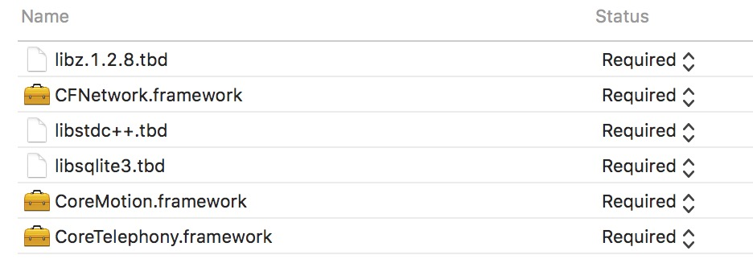
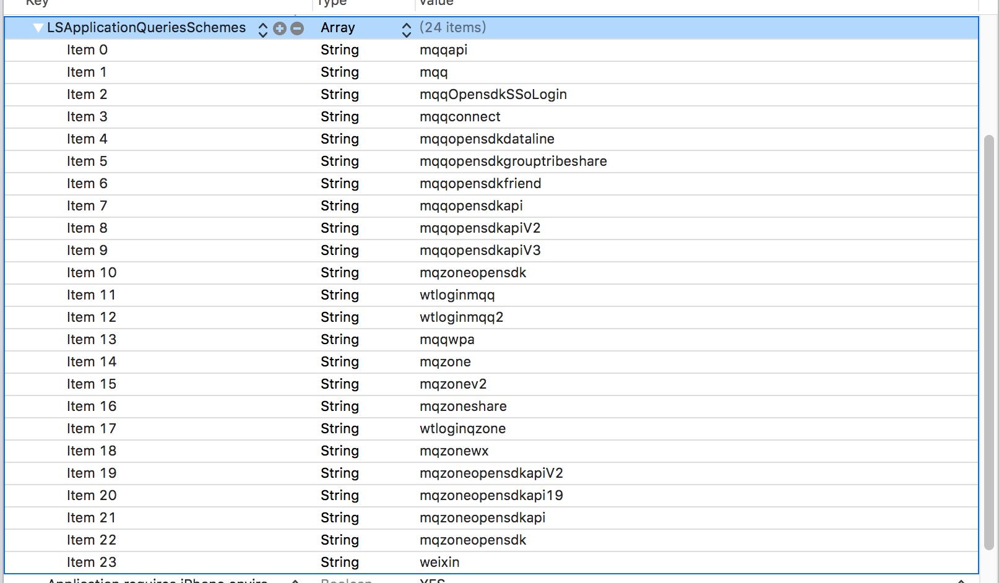
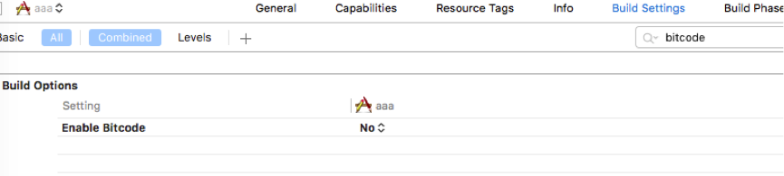
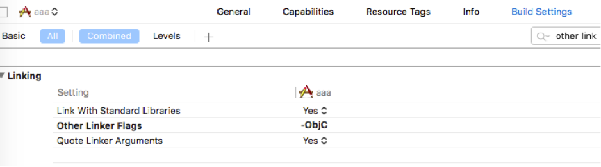
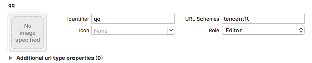
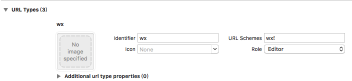
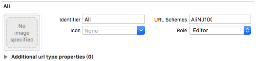
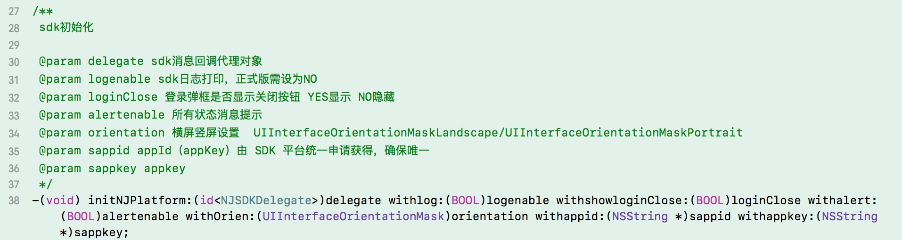
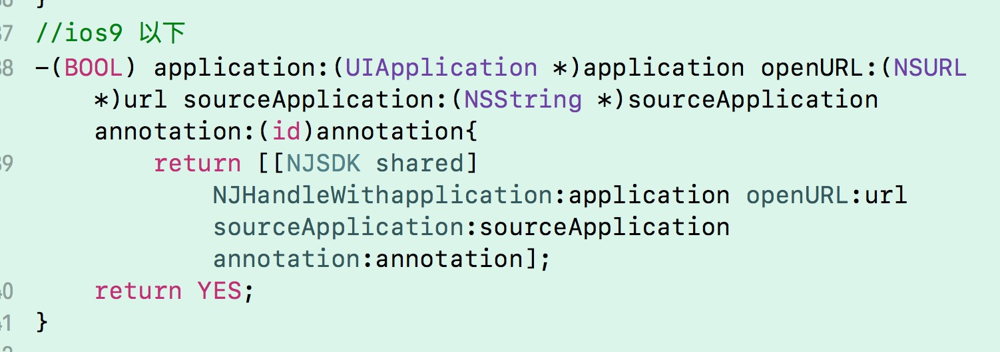
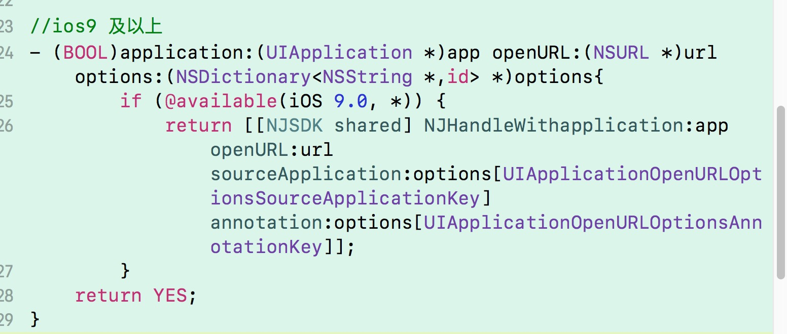

### 1.概述

该文档主要对明日世界SDK iOS端接口接入、打包、审核注意事项等进行描述，方便游戏开发者快速接入。
### 2.注意事项
* 使用前请注意查阅readMe中的更新日志
* SDK支持的系统为iOS8.0或以上版本，设备为iPhone5或更新设备
* SDK所支持架构：armv7 、arm64
* appId、appKey、appsecret由明日世界SDK平台统一申请获得，确保唯一
* 需在appdDelegate.m中调用SDK相关方法，在使* 用SDK其他接口前，必须先调用初始化接口；
屏幕方向:横屏
* UIInterfaceOrientationMaskLandscape/竖屏UIInterfaceOrientationMaskPortrait
* 游戏入口界面 ，必须有一个登录按钮或者主动触发登录接口
* 游戏在处理SDK回调时，请自行做好线程维护：即主线程（UI线程）和子线程（耗时操作）

### 3.接入配置
* 把framework文件夹下的 NJCoreSDK.framework 、NJBaseSDK.bundle加入工程；
* 针对官方包，把官方文件夹明日世界加入工程；

### 4.依赖库的添加

``` 
Foundation.framework、UIKit.framework、StoreKit.framework、AdSupport.framework、JavaScriptCore.framework、CFNetwork.framework、Security.framework、CoreMotion.framework、CoreTelephony.framework、SystemConfiguration.framework、CoreGraphics.framework、ImageIO.framework、QuartzCore.framework、libsqlite3.tbd(旧版为.dylib)、libc++.1.tbd、libz.1.2.5.tbd
```

### 5.相关环境配置
(右键点击Info.plist -> Open As -> Source Code -> 把下方文本直接复制粘贴到相应位置即可)
关闭HTTPS设置

```
<key>NSAppTransportSecurity</key>
<dict>
<key>NSAllowsArbitraryLoads</key>
<true/>
</dict>
```

### 6.设置应用白名单


```
<key>LSApplicationQueriesSchemes</key>
<array>
<string>alipay</string>
<string>mqqapi</string>
<string>mqq</string>
<string>mqqOpensdkSSoLogin</string>
<string>mqqconnect</string>
<string>mqqopensdkdataline</string>
<string>mqqopensdkgrouptribeshare</string>
<string>mqqopensdkfriend</string>
<string>mqqopensdkapi</string>
<string>mqqopensdkapiV2</string>
<string>mqqopensdkapiV3</string>
<string>mqzoneopensdk</string>
<string>wtloginmqq</string>
<string>wtloginmqq2</string>
<string>mqqwpa</string>
<string>mqzone</string>
<string>mqzonev2</string>
<string>mqzoneshare</string>
<string>wtloginqzone</string>
<string>mqzonewx</string>
<string>mqzoneopensdkapiV2</string>
<string>mqzoneopensdkapi19</string>
<string>mqzoneopensdkapi</string>
<string>mqzoneopensdk</string>
<string>weixin</string>
</array>
```

#### 由于SDK不支持Bitcode 所以需要关闭bitcode

#### 配置链接器Other Linker Flags 加入标识
-ObjC(注意大小写)或者-force_load


### URL Schemes 配置
* QQ  URL Schemes

    eg:tencentxxxxxx



* 微信 URL Schemes

    eg:wxxxxxxxxx



* 支付宝取消支付 URL Schemes

    注：AliNJ+appid (appid由SDK平台统一申请获得) 
        
    eg: AliNJ10001




### 7.SDK启动配置（applicationDelegate）

* 启动设置 sdk 初始化 必须接受到初始化成功的回调后才可以调用登录  



* 在APPDelegate.m实现方法（同时实现两个方法）




### 8.接口调用

```
/** 请在SDK初始化成功后才调用登录接口，否则会出现异常
* 弹出登录界面，第二次登录则自动登录
*/
-(void) login;
/** 注销登录，会保存登录账号 */
-(void) logout;
/** 登录状态查询 */
-(BOOL) isLogin;
/**
* 防沉迷信息实时查询接口
* 结果见防沉迷回调
*/
-(void) fcm_RealTimeQuery;
/**
* 实名制实时查询接口
* 查询是否绑定了手机号
*/
-(void) checkBindPhone;
/**
* 实名制实时查询接口
* 查询是否绑定了身份证
*/
-(void) checkBindIDcard;
/**
*  强制弹出实名制认证 (如未绑定过手机会先跳转手机绑定页面)
*/
-(void) showIdCardVerifyView;
/**
*   hud 提示信息
*/
-(void)showMessage:(NSString*)message;

/** 调用付款接口 */
- (void) njPayOrder:(NSDictionary *)data;
```
注：调用付款接口所需参数
```
eg:
{   "status":200,
    "message":"操作成功",
    "data":{
        "order_no":"P986559359666491392" ,
        "param": {
        "amount":"100",
        "ch_product_id":"com.nextjoygames.xxx.coins1",
        "ios":"1",
        "pay_url":"http://192.168.0.206:8081/pay_order/type",
        "payment_type":"10"
            }
        }
}


```

```
/** 显示用户协议界面(隐私政策)
*  针对游戏里拥有排行榜相关类似功能时使用
*/
-(void) showUserAgreementView;

/**
显示悬浮球
@param floatX 悬浮球X坐标
@param floatY 悬浮球Y坐标
floatX floatY 固定位置时必须都大于0 不固定位置或者显示隐藏前的位置时必须都传0
*/
- (void)showFloatCircleWithCGFloatX:(CGFloat)floatX CGFloatY:(CGFloat)floatY;
/**
隐藏悬浮球
*/
- (void)hiddenFloatCircle;
/**
展示分享界面

@param ShareArray 分享数组
@"WeixinFriend"            -------->微信
@"WeixinTimeline"          -------->微信朋友圈
@"QQFriend"                -------->QQ
@"QQSpace"                 ------->QQ空间
@param shareMsg 分享信息 @"imgPath" 图片路径 图片不能传空，大小必须在3M以内，
*/
- (void) showShareViewWithTypes:(NSArray *)ShareArray shareMsg:(NSDictionary *)shareMsg;
/**
*   获取配置信息
*   NJ_wx_appid_key         微信appid
*   NJ_wx_appsecret_key     微信 appsecret
*   NJ_qq_appid_key         qq appid
*   NJ_ry_appkey_key        热云appkey
*   NJ_channel_id_key       渠道id
*   NJ_acid_key             子渠道id
*   NJ_appid_key            明日世界 app_id
*   NJ_child_id_key         马甲包id
*   NJ_package_id_key       包id
*   NJ_app_ver_key          app版本
*   NJ_sdk_ver_key          sdk版本
*   NJ_api_ver_key          api版本
*   NJ_protocol_url_key     用户协议
*   NJ_uuid_key             imei
*   NJ_host_key             host
*
*/
- (id)getConfig:(NJCONFIG_PLIST_KEY_NAME *)key;
/**
*   用户信息
*   token 用户token;       user_type用户类型;  phone用户手机号;     account用户账号;
*   safe_level安全等级;     fcm防沉迷;         idCard身份证号
*/
- (NJUserModel *)userInfo;

```
### 9.sdk响应回调
```
/**
*  支付 登录 防沉迷 分享相关回调全部通过此接口回调
*  NJInitRep    初始化回调类型
*  NJLoginRep   登录相关回调类型
*  NJLogoutRep  注销回调类型
*  NJPayRep     支付回调类型
*  NJFCMRep     防沉迷信息回调类型
*  NJQQResp     qq分享回调类型
*  NJWXResp     微信分享回调类型
*/
- (void)nj_onResp:(NJResp *)resp;
```
回调类型判断 
```
if ([resp isKindOfClass:[NJLoginRep class]]) {
    NJLoginRep *res = (NJLoginRep *)resp;
}
```
详细字段说明  回调接口名
*   NJInitRep 初始化回调类型
```
    参数：success是否成功   YES    NO
    erroReason  错误描述，success等于YES的时候为空，success等于NO的时候才有
```
*   NJLoginRep 登录相关回调类型
```
    参数：success是否成功   YES    NO
    erroReason  错误描述，success等于YES的时候为空，success等于NO的时候才有
    actoken     平台分配给cp的token
```
*   NJLogoutRep 注销回调类型
```
    参数：success是否成功   YES    NO
    erroReason  错误描述，success等于YES的时候为空，success等于NO的时候才有
```
*   NJPayRep 支付回调类型
```
    参数：success是否成功   YES    NO
    erroReason  错误描述，success等于YES的时候为空，success等于NO的时候才有
    type    NJPayTypeIAP     IAP内购支付;
            NJPayTypeWX      微信支付;
            NJPayTypeAli     支付宝支付
```
*   NJFCMRep 防沉迷信息回调类型
```
    参数：success是否成功   YES    NO
    erroReason  错误描述，success等于YES的时候为空，success等于NO的时候才有
    fcm       /* -1 未添加认证  0 添加未通过  1 认证通过  */
```
*   NJQQResp qq分享回调类型
```
    参数：success是否成功   YES    NO
    erroReason  错误描述，success等于YES的时候为空，success等于NO的时候才有
```
*   NJWXResp 微信分享回调类型
```
    参数：success是否成功   YES    NO
    erroReason  错误描述，success等于YES的时候为空，success等于NO的时候才有
```

```
/**
* 实名制实时查询回调
@param binded YES已绑定手机号；NO未绑定手机号
*/
-(void) checkBindPhone:(BOOL)binded;
/**
* 实名制实时查询回调
@param binded YES已绑定身份证；NO未绑定身份证
*/
-(void) checkBindIDcard:(BOOL)binded;
```

### 10.如需模拟器版本请联系我们,其他详见Demo

### 11.遇到问题

* 支付没有回调

SDK现在接入h5的支付方式， SDK是没办法接收h5支付界面支付的回调。因此需要游戏方自行处理优化支付的界面逻辑

* 设置横屏之后，SDK出现竖屏界面  （unity项目）

UnityAppController.mm  里面supportedInterfaceOrientationsForWindow 方法影响，暂时是 如果没用到此方法，可以直接删掉此方法 ；欢迎反馈其他解决办法